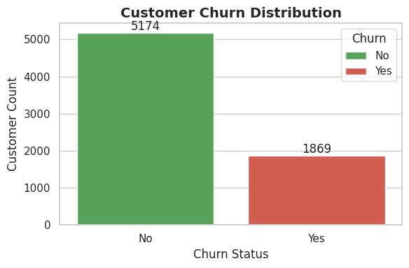
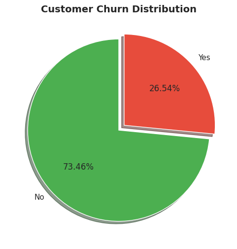
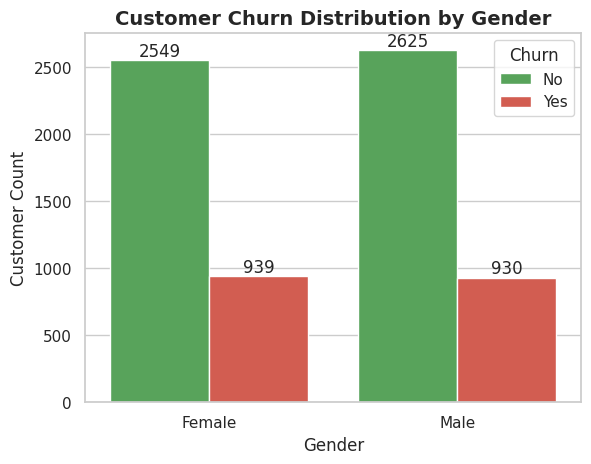
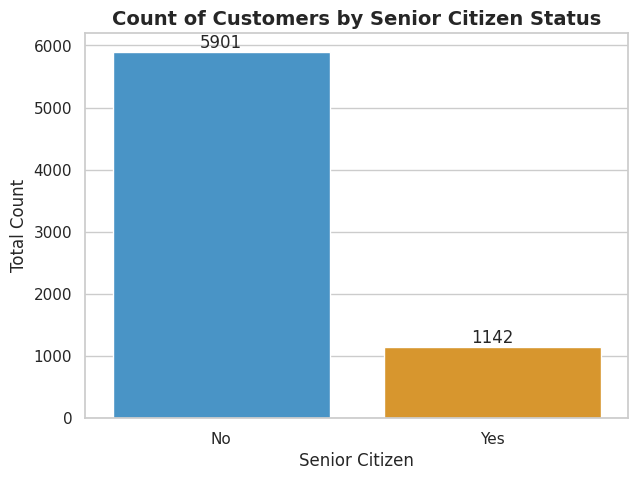
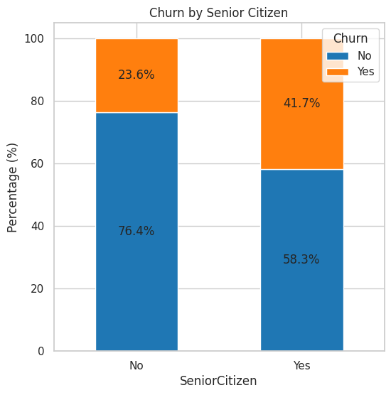
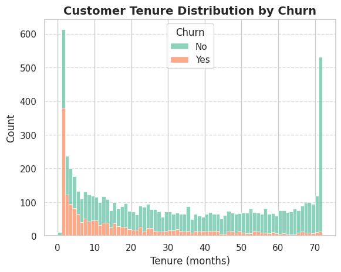
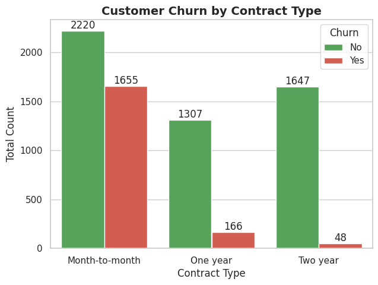
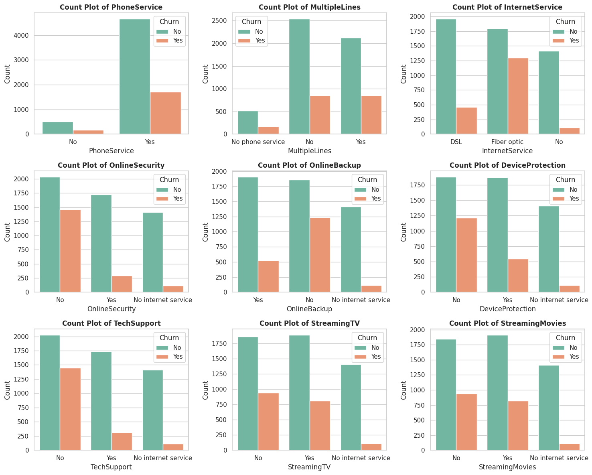
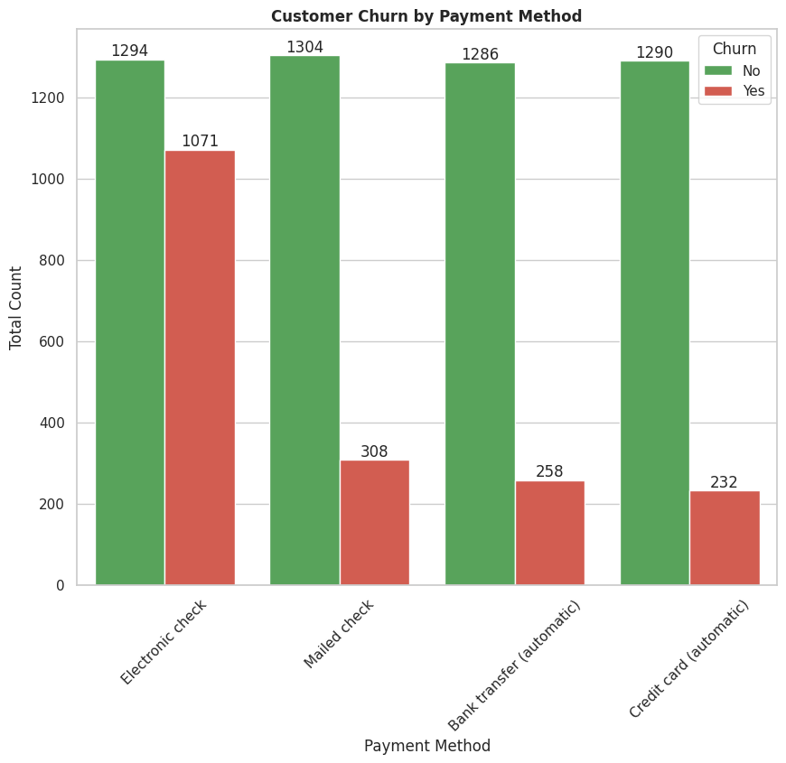
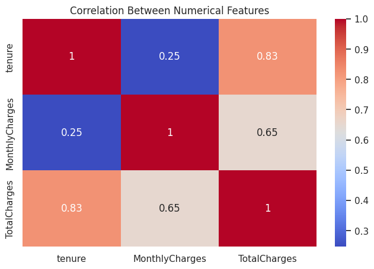

# 📊 Telco Customer Churn Analysis

## 📌 Project Overview

Customer churn is one of the biggest challenges faced by subscription-based businesses. Acquiring a new customer often costs significantly more than retaining an existing one. This project analyzes customer behavior patterns to identify the key factors that contribute to customer churn and provides actionable business recommendations to improve customer retention.

Using Exploratory Data Analysis (EDA), we investigate demographic information, account details, subscribed services, payment methods, and customer tenure to uncover meaningful insights.

---

## 🎯 Business Objective

The primary objective of this project is to:

- Identify factors influencing customer churn.
- Understand customer behavior patterns.
- Discover high-risk customer segments.
- Provide data-driven recommendations to reduce churn.
- Support business decision-making through analytical insights.

---

## 📂 Dataset Information

The dataset contains customer information from a telecommunications company.

### Dataset Features

- Customer Demographics
- Gender
- Senior Citizen Status
- Partner Status
- Dependents Status
- Tenure
- Contract Type
- Internet Services
- Phone Services
- Payment Methods
- Monthly Charges
- Total Charges
- Churn Status

### Dataset Size

- Rows: 7,043
- Columns: 21

---

## 🛠️ Technologies Used

- Python
- Pandas
- NumPy
- Matplotlib
- Seaborn
- Jupyter Notebook

---

## 🔄 Project Workflow

### 1. Data Understanding
- Understanding dataset structure
- Exploring columns and data types

### 2. Data Cleaning
- Handling missing values
- Correcting data types
- Removing inconsistencies

### 3. Exploratory Data Analysis (EDA)
- Customer segmentation
- Churn analysis
- Service analysis
- Contract analysis

### 4. Data Visualization
- Bar Charts
- Pie Charts
- Histograms
- Count Plots
- Heatmaps

### 5. Business Insights
- Identifying churn drivers
- Finding customer retention opportunities

---

# 📈 Visualizations

## 1. Customer Churn Distribution (Bar Chart)

---

## 2. Customer Churn Distribution (Pie Chart)

---

## 3. Gender vs Churn Analysis

---

## 4. Senior Citizen vs Churn Analysis

---

## 5. Churn Percentage by Senior Citizen Category

---

## 6. Tenure Distribution by Churn Status

---

## 7. Contract Type vs Churn Analysis

---

## 8. Service Features Impact on Churn

---

## 9. Payment Method vs Churn Analysis

---

## 10. Correlation Analysis Heatmap

---

# 📊 Executive Summary

The analysis reveals several significant patterns associated with customer churn.

### Major Churn Drivers

✅ Month-to-Month Contracts

✅ Low Customer Tenure

✅ Lack of Online Security Services

✅ Lack of Technical Support Services

✅ Electronic Check Payment Method

These factors indicate that customers with shorter commitments and fewer value-added services are more likely to leave the company.

---

# 🔍 Key Insights

### Contract Type

Customers with month-to-month contracts exhibit the highest churn rates compared to customers with longer-term contracts.

### Customer Tenure

Customers with shorter tenure are significantly more likely to churn than long-term customers.

### Online Security

Customers without online security services show a higher tendency to leave the company.

### Technical Support

The absence of technical support services is strongly associated with increased churn.

### Payment Method

Customers using electronic checks demonstrate a noticeably higher churn rate.

---

# 💡 Business Recommendations

### 1. Promote Long-Term Contracts

Offer discounts and incentives for annual and multi-year contract plans.

### 2. Improve Customer Onboarding

Develop onboarding programs to improve customer experience during the early stages of service.

### 3. Bundle Value-Added Services

Encourage adoption of Online Security and Tech Support packages.

### 4. Strengthen Retention Campaigns

Target high-risk customers with personalized retention offers.

### 5. Monitor High-Risk Segments

Implement churn prediction systems to proactively identify customers likely to leave.

---

# 🎓 Project Learnings

Through this project, I gained practical experience in:

- Data Cleaning and Preprocessing
- Exploratory Data Analysis (EDA)
- Customer Segmentation
- Data Visualization
- Business Insight Generation
- Correlation Analysis
- Storytelling with Data
- Data-Driven Decision Making

---

# 🚀 Future Improvements

- Build a Customer Churn Prediction Model
- Apply Machine Learning Algorithms
- Create an Interactive Power BI Dashboard
- Deploy an End-to-End Analytics Dashboard
- Perform Customer Lifetime Value Analysis

---

⭐ If you found this project useful, consider giving the repository a star.
